# Lab Tasks

The end goal of these lab tasks is to make sure LAN-B connectivity works end to
end and to understand end-to-end packet troubleshooting on Cisco Secure Firewall.

## Tasks summary

Run all those tests to complete this job and understand end-to-end packet
troubleshooting and successful test results.

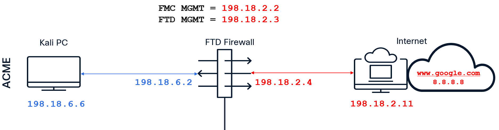

These are all the test tasks:

```text
INSIDE TO OUTSIDE:
1. ping from 198.18.6.6 to 198.18.6.2 (ACME FTD inside interface)
2. ping from 198.18.6.6 to 198.18.2.11 (ACME Kali PC)
3. ping from 198.18.6.6 to 8.8.8.8
4. ping from 198.18.6.6 to www.google.com

OUTSIDE TO INSIDE
5. ping from 198.18.2.11 or 10 to 198.18.6.6
```

If all five of your pings are successful, then you have completed the lab. If
not, let's start troubleshooting and go to the next task.

## Tips for troubleshooting

- Check PC's IP/mask/gateway/Firewall
- Check Firewall routing, ACP, NAT

(Optional) Write a quick web page to test in Kali – `index.html`

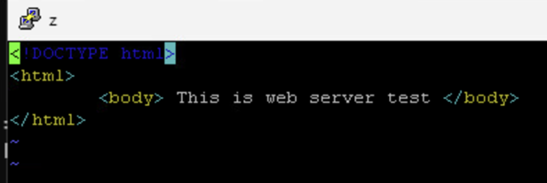

## Lab Login Details

| Device | URL / Access | Username | Password |
| --- | --- | --- | --- |
| FMC | https://198.18.2.2 | admin | dCloud123! |
| FMC | https://198.18.1.2 | admin | Cisco@123 |
| Windows 11 | console | admin | C1sco12345 |
| Kali Linux | console | kali | C1sco12345 |

## Task 1

Please login to both Kali PCs (Green box) highlighted in the below diagram for
this task. Log in to the LAN-B Kali PC, open the terminal, and run the following
ping commands to check the connectivity.

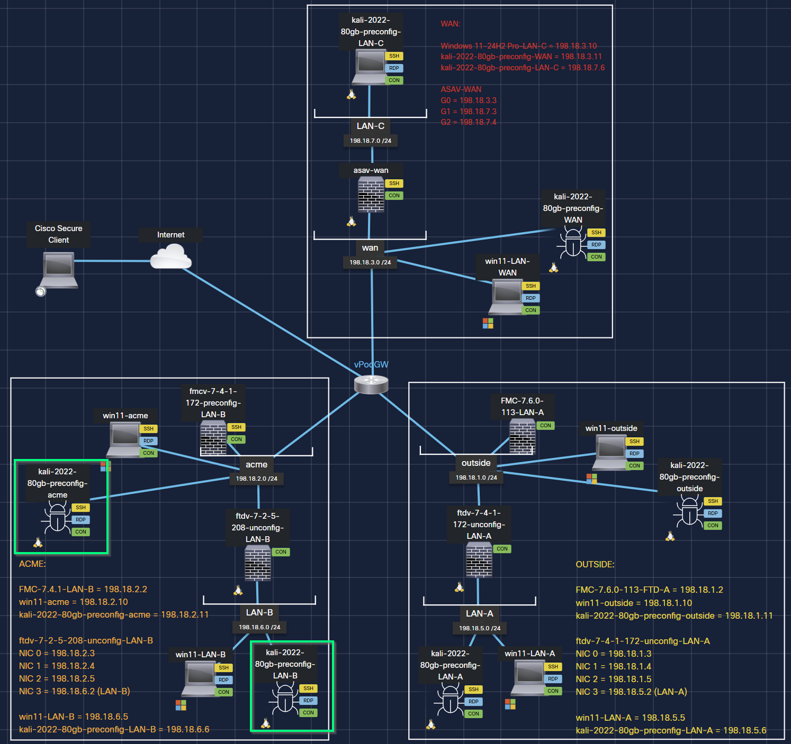

```text
1. ping 198.18.6.2 (ACME FTD inside interface)
2. ping 198.18.2.11 (ACME Kali PC)
3. ping 8.8.8.8
4. ping www.google.com
```

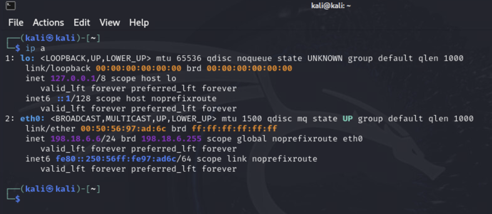

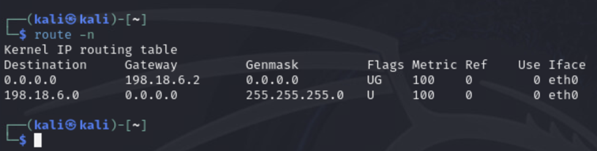

- A. ping 198.18.6.2 (ACME FTD inside interface)

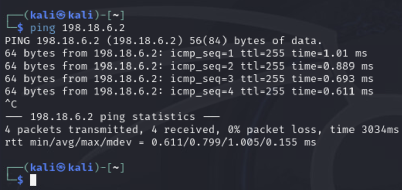

```text
1. ping 198.18.2.11 (ACME Kali PC)
2. ping 8.8.8.8
3. ping google.com
```

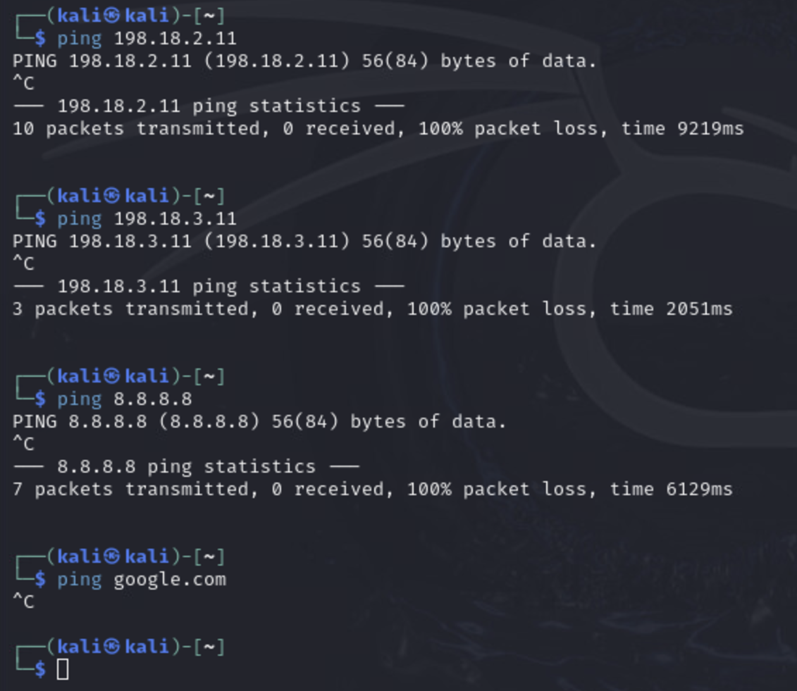

## Task 2

Troubleshoot through FTD CLI. SSH to FTD management IP 198.18.2.3 (please use the
win11-acme Windows PC to SSH to the FTD using PuTTY).

!!! note
    This is the optional troubleshooting through CLI; you can also do the same
    troubleshooting using the FMC Web GUI.

**Check routing**

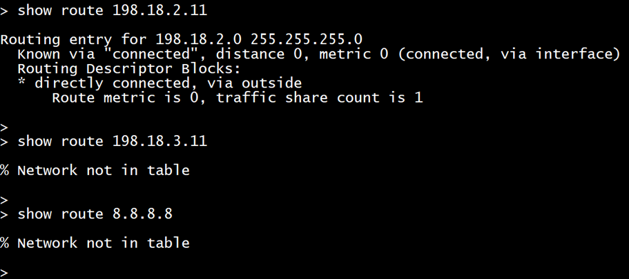

**Packet-tracer (simulate decision path)** — FTD CLI: Look for where it's
allowed/denied (NAT, Route Lookup, Access-Control, etc.).

```text
> packet-tracer input inside icmp 198.18.6.6 8 0 198.18.2.11 detailed

Phase: 1
Type: ACCESS-LIST
Subtype:
Result: ALLOW
Elapsed time: 51923 ns
Config:
Implicit Rule
Additional Information:
 Forward Flow based lookup yields rule:
 in  id=0x149ac0317560, priority=1, domain=permit, deny=false
        hits=634, user_data=0x0, cs_id=0x0, l3_type=0x8
        src mac=0000.0000.0000, mask=0000.0000.0000
        dst mac=0000.0000.0000, mask=0100.0000.0000
        input_ifc=inside, output_ifc=any

Phase: 2
Type: ROUTE-LOOKUP
Subtype: No ECMP load balancing
Result: ALLOW
Elapsed time: 22361 ns
Config:
Additional Information:
Destination is locally connected. No ECMP load balancing.
Found next-hop 198.18.2.11 using egress ifc  outside(vrfid:0)

Phase: 3
Type: OBJECT_GROUP_SEARCH
Subtype:
Result: ALLOW
Elapsed time: 0 ns
Config:
Additional Information:
 Source Object Group Match Count:       0
 Destination Object Group Match Count:  0
 Object Group Search:                   0

Phase: 4
Type: ACCESS-LIST
Subtype: log
Result: DROP
Elapsed time: 303 ns
Config:
access-group CSM_FW_ACL_ global
access-list CSM_FW_ACL_ advanced deny ip any any rule-id 268434432
access-list CSM_FW_ACL_ remark rule-id 268434432: ACCESS POLICY: Policy_FTD-LAN-B - Default
access-list CSM_FW_ACL_ remark rule-id 268434432: L4 RULE: DEFAULT ACTION RULE
Additional Information:
 Forward Flow based lookup yields rule:
 in  id=0x149ac03e50c0, priority=12, domain=permit, deny=true
        hits=1710, user_data=0x149a930d6c80, cs_id=0x0, use_real_addr, flags=0x0, protocol=0
        src ip/id=0.0.0.0, mask=0.0.0.0, port=0, tag=any, ifc=any
        dst ip/id=0.0.0.0, mask=0.0.0.0, port=0, tag=any, ifc=any,, dscp=0x0, nsg_id=none
        input_ifc=any, output_ifc=any

Result:
input-interface: inside(vrfid:0)
input-status: up
input-line-status: up
output-interface: outside(vrfid:0)
output-status: up
output-line-status: up
Action: drop
Time Taken: 74587 ns
Drop-reason: (acl-drop) Flow is denied by configured rule, Drop-location: frame 0x00005611d409b518 flow (NA)/NA
>
```

**Checking asp drop**

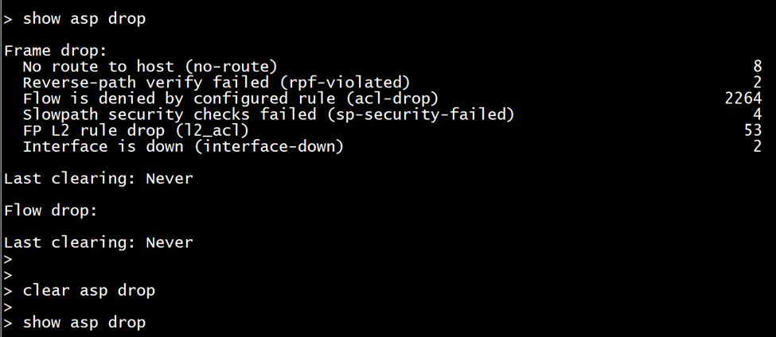

**Real packet captures (inside &amp; outside)** (ASA-style captures on many FTD
versions).

Interpretation:

- Seen on inside, not on outside → ACP or NAT/routing problem.
- Seen on outside with translated SRC = 198.18.2.4 → NAT is working; check upstream/return path.
- Replies seen on outside but not on inside → return blocked (ACP), asymmetric routing, or inspection/state issue.

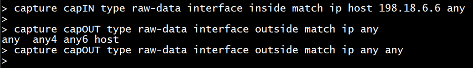

```text
capture capIN type raw-data interface inside match ip host 198.18.6.6 any
capture capOUT type raw-data interface outside match ip any any
```

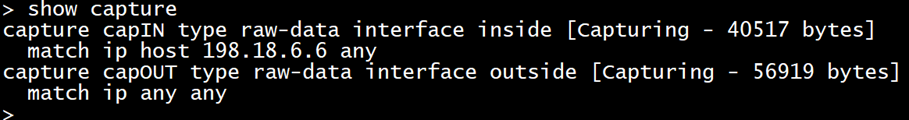

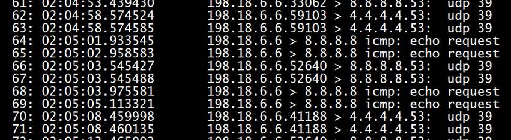

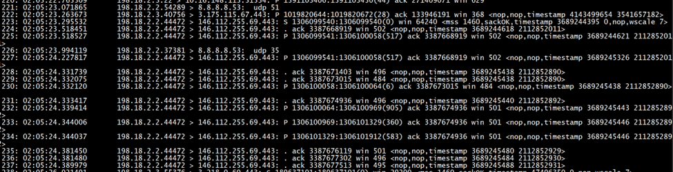

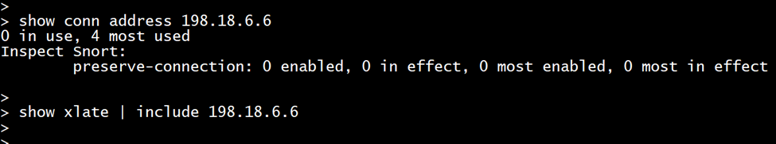

**Connection/Xlate tables** — expect a translated (xlated) entry and an active
connection when traffic flows.

```text
show conn address 198.18.6.6
show xlate | include 198.18.6.6
```

**Quick command crib (FTD CLI)**

```text
show interface ip brief
show route
show arp
show nat detail
show xlate | include 198.18.6.6
show conn address 198.18.6.6
packet-tracer input inside icmp 198.18.6.6 8 0 8.8.8.8 detailed
capture capIN type raw-data interface inside match ip host 198.18.6.6 any
capture capOUT type raw-data interface outside match ip any any
show capture capIN
show capture capOUT
no capture capIN
no capture capOUT
show asp drop
```

**Checking the default ACP action, ACP and NAT.** Please note:

- Default ACP action is "Block"
- Please make sure to check the Default ACP Action log configuration
- No ACP rules configured
- No NAT rules configured

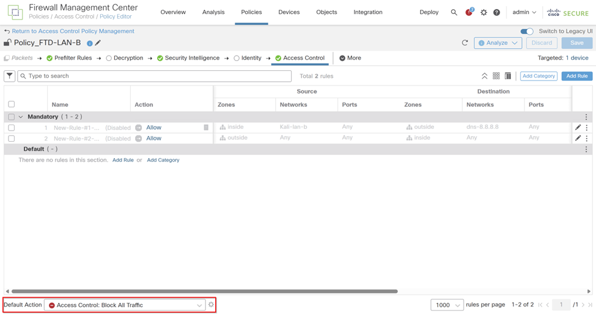

**Check what are the default actions**

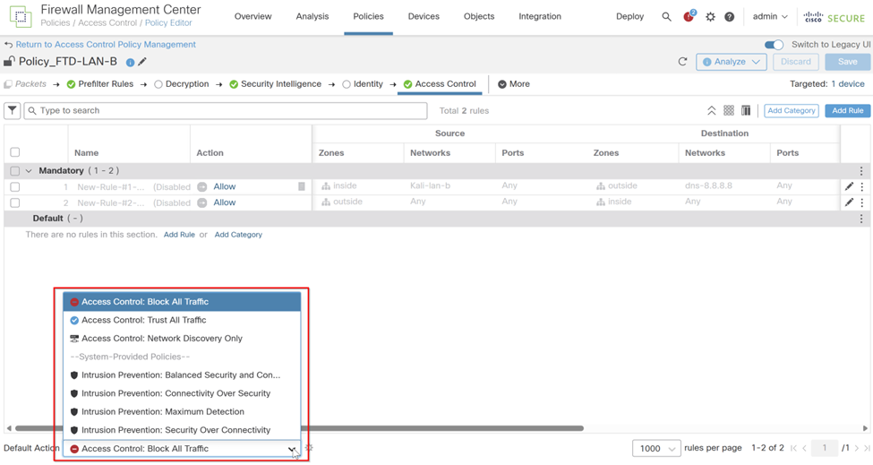

**Checking connection events**

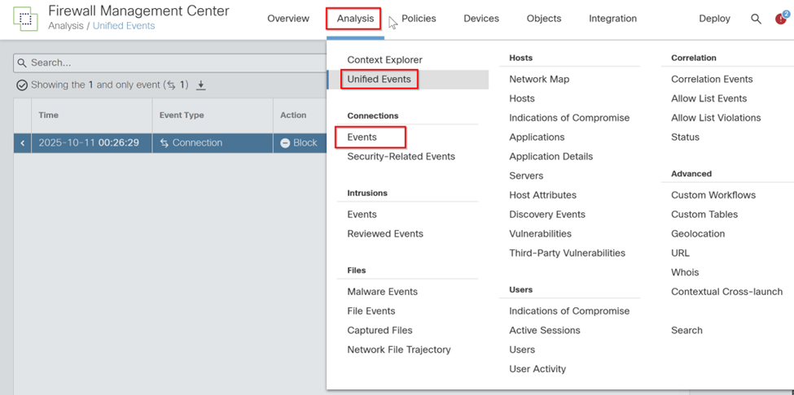

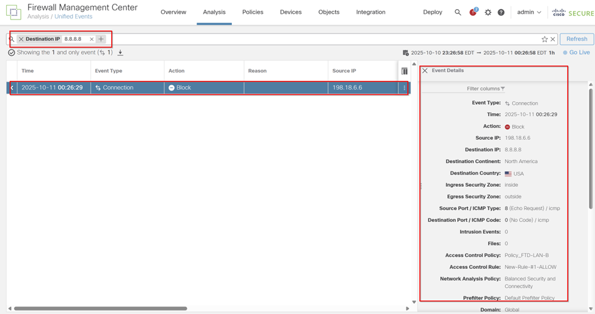

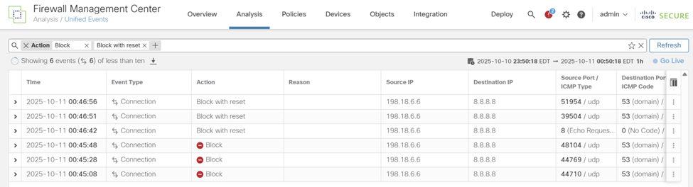

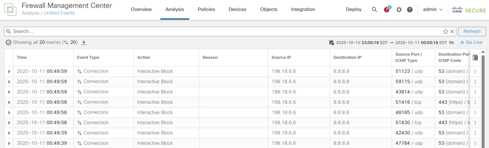

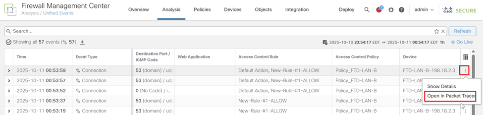

**Enable ACP rules analysis**

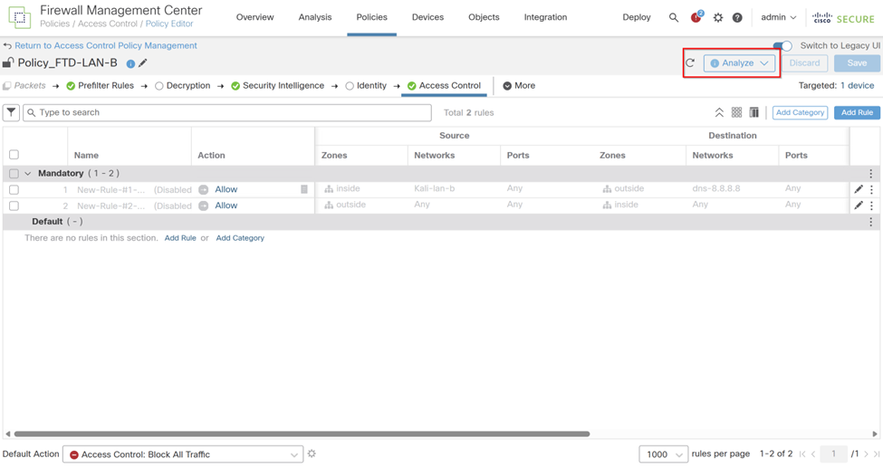

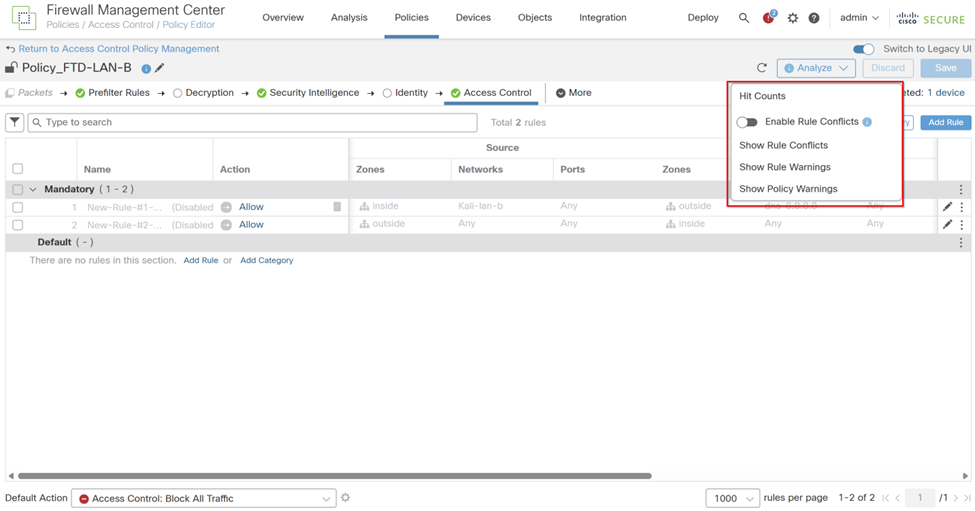

**Enable or disable event columns.** Click the X to mark any of the fields.

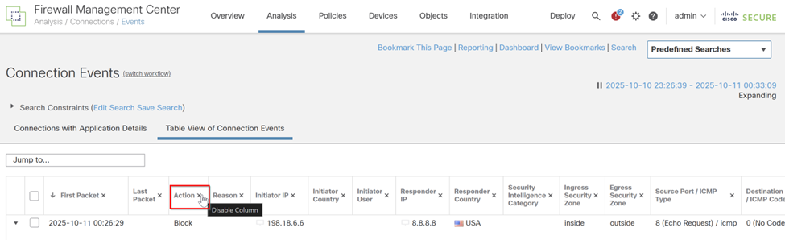

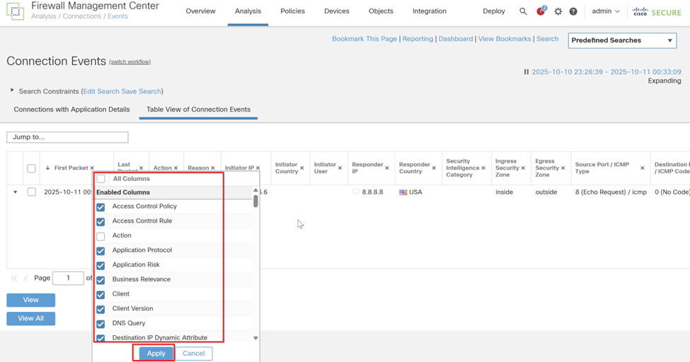

**Advanced search**

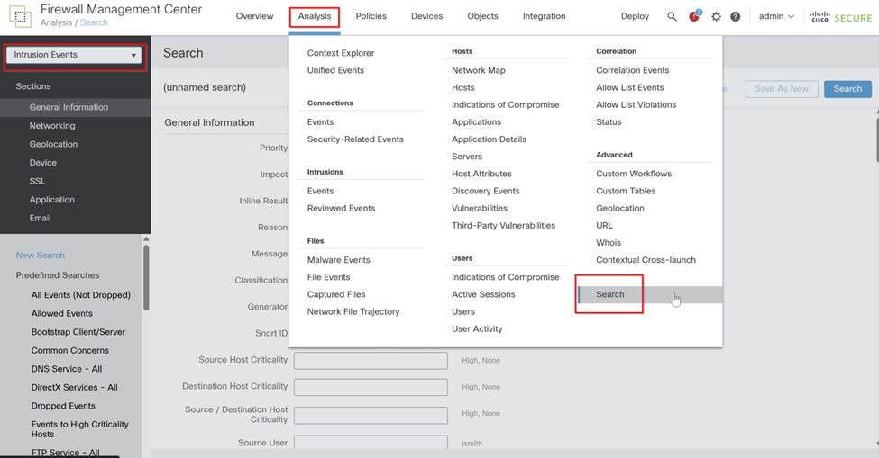

**Packet Tracer using GUI**

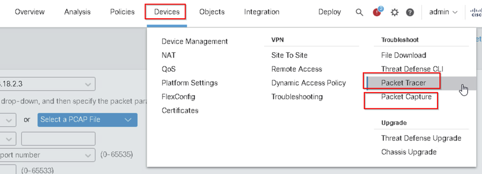

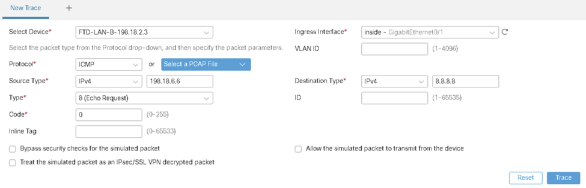

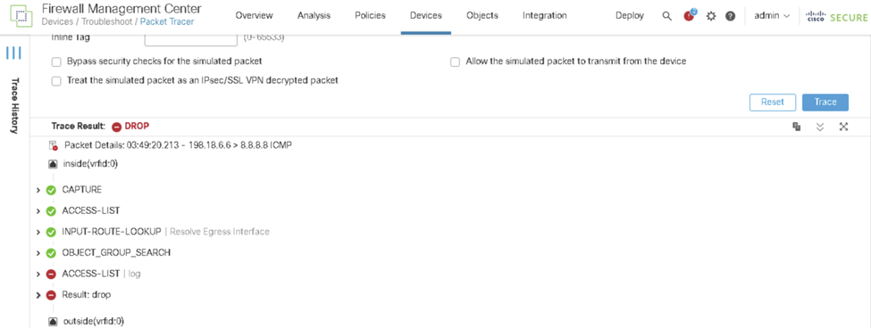

**Check the issue regarding packet drops and their reasons.**

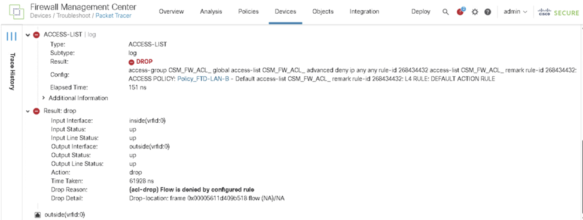

```text
Interface: GigabitEthernet0/1
VLAN ID:
Protocol: ICMP
Source Type: IPv4
Source IP value: 198.18.6.6
Destination Type: IPv4
Destination IP value: 8.8.8.8
ICMP Code: 0
ICMP ID:
ICMP Type: 8 (Echo Request)
Treat simulated packet as IPsec/SSL VPN decrypt: false
Bypass all security checks for simulated packet: false
Allow simulated packet to transmit from device: false
Select Device: FTD-LAN-B-198.18.2.3
Run trace on all cluster members: false

Device details
Name: FTD-LAN-B-198.18.2.3
Type: Device
ID: cf3467b2-c6e4-11ee-852c-b95da810329f

Phase 1
Elapsed Time: 20087 ns
Type: CAPTURE
ID: 1
Config:
Result: ALLOW
Additional Information: Forward Flow based lookup yields rule: in id=0x149a6cf6fc90, priority=13, domain=capture, deny=false hits=215, user_data=0x149ac03e98e0, cs_id=0x0, l3_type=0x0 src mac=0000.0000.0000, mask=0000.0000.0000 dst mac=0000.0000.0000, mask=0000.0000.0000 input_ifc=inside, output_ifc=any

Phase 2
Config: Implicit Rule
Elapsed Time: 20087 ns
Type: ACCESS-LIST
ID: 2
Additional Information: Forward Flow based lookup yields rule: in id=0x149ac0317560, priority=1, domain=permit, deny=false hits=8079, user_data=0x0, cs_id=0x0, l3_type=0x8 src mac=0000.0000.0000, mask=0000.0000.0000 dst mac=0000.0000.0000, mask=0100.0000.0000 input_ifc=inside, output_ifc=any
Result: ALLOW

Phase 3
ID: 3
Config:
Result: ALLOW
Type: INPUT-ROUTE-LOOKUP
Elapsed Time: 21603 ns
Subtype: Resolve Egress Interface
Additional Information: Found next-hop 198.18.2.1 using egress ifc outside(vrfid:0)

Phase 4
Result: ALLOW
Additional Information: Source Object Group Match Count: 0 Destination Object Group Match Count: 0 Object Group Search: 0
Config:
ID: 4
Elapsed Time: 0 ns
Type: OBJECT_GROUP_SEARCH

Phase 5
Result: DROP
ID: 5
Config: access-group CSM_FW_ACL_ global access-list CSM_FW_ACL_ advanced deny ip any any rule-id 268434432 access-list CSM_FW_ACL_ remark rule-id 268434432: ACCESS POLICY: Policy_FTD-LAN-B - Default access-list CSM_FW_ACL_ remark rule-id 268434432: L4 RULE: DEFAULT ACTION RULE
Additional Information: Forward Flow based lookup yields rule: in id=0x149ac03e50c0, priority=12, domain=permit, deny=true hits=7633, user_data=0x149a930d6c80, cs_id=0x0, use_real_addr, flags=0x0, protocol=0 src ip/id=0.0.0.0, mask=0.0.0.0, port=0, tag=any, ifc=any dst ip/id=0.0.0.0, mask=0.0.0.0, port=0, tag=any, ifc=any,, dscp=0x0, nsg_id=none input_ifc=any, output_ifc=any
Subtype: log
Type: ACCESS-LIST
Elapsed Time: 151 ns

Result
Output Line Status: up
Input Status: up
Drop Detail: Drop-location: frame 0x00005611d409b518 flow (NA)/NA
Input Line Status: up
Time Taken: 61928 ns
Drop Reason: (acl-drop) Flow is denied by configured rule
Output Status: up
Output Interface: outside(vrfid:0)
Action: drop
Input Interface: inside(vrfid:0)
```

**Packet Capture using GUI**

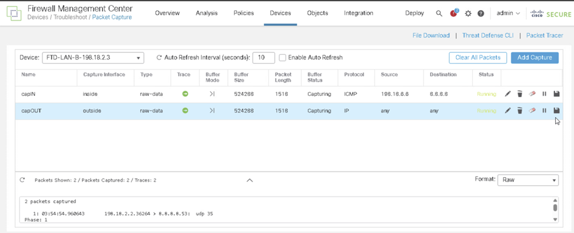

**Save packet capture and analyse through Wireshark.**

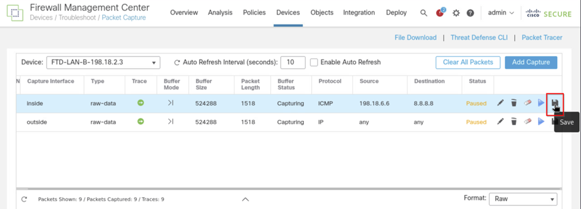

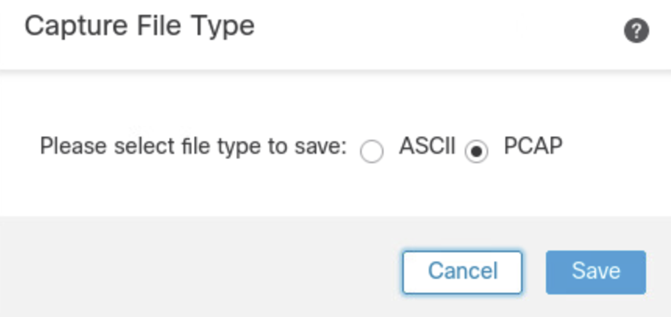

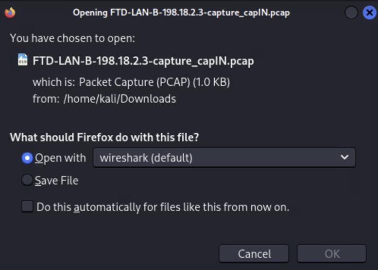

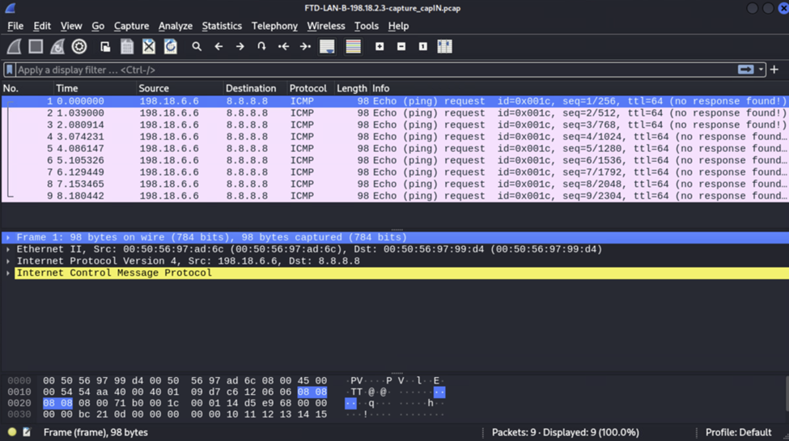

## Task 3

Allow traffic from inside 198.18.6.6 to outside 8.8.8.8.

Check Secure Firewall configuration. Login to FMC https://198.18.2.2
(admin / dCloud123!)

- Check the Interface IPs, Routing, and zones
- Check required ACP and NAT policies

**Policies > Access control**

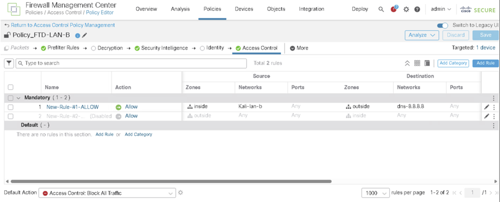

**Device > NAT**

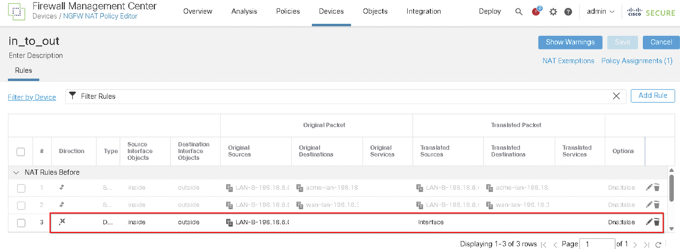

Once you have completed your Firewall configuration, make sure to Save and deploy
it (select the Ignore warning for this lab).

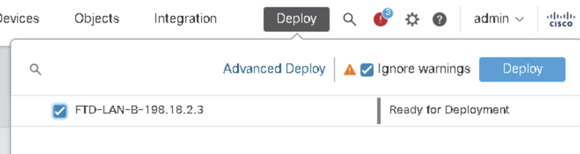

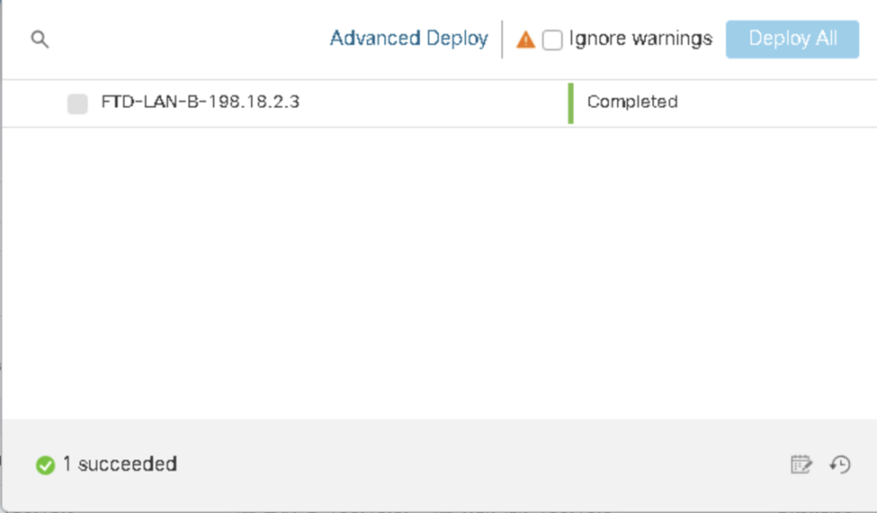

Check the packet captures again to see the results.

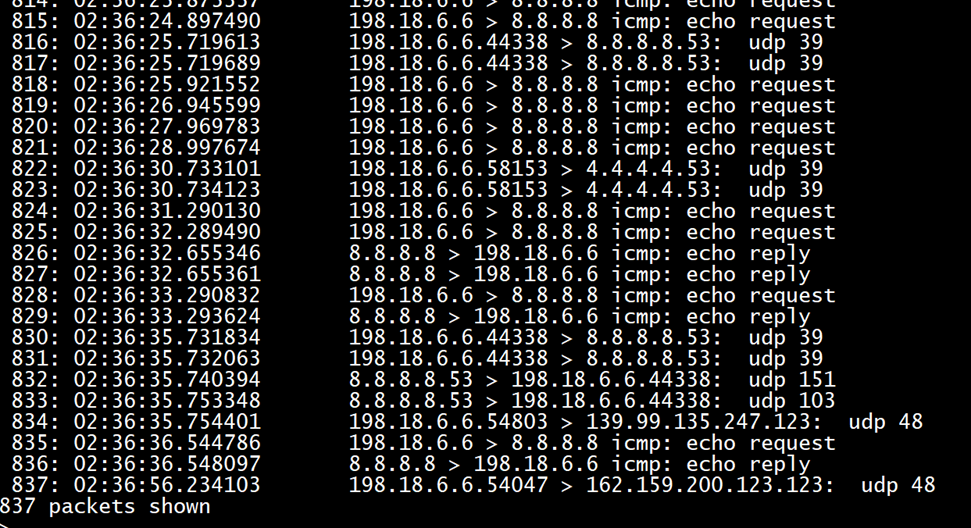

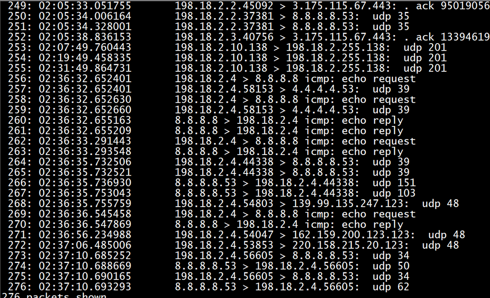

Very important to stop the captures once you finish troubleshooting.

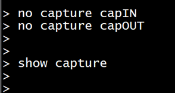

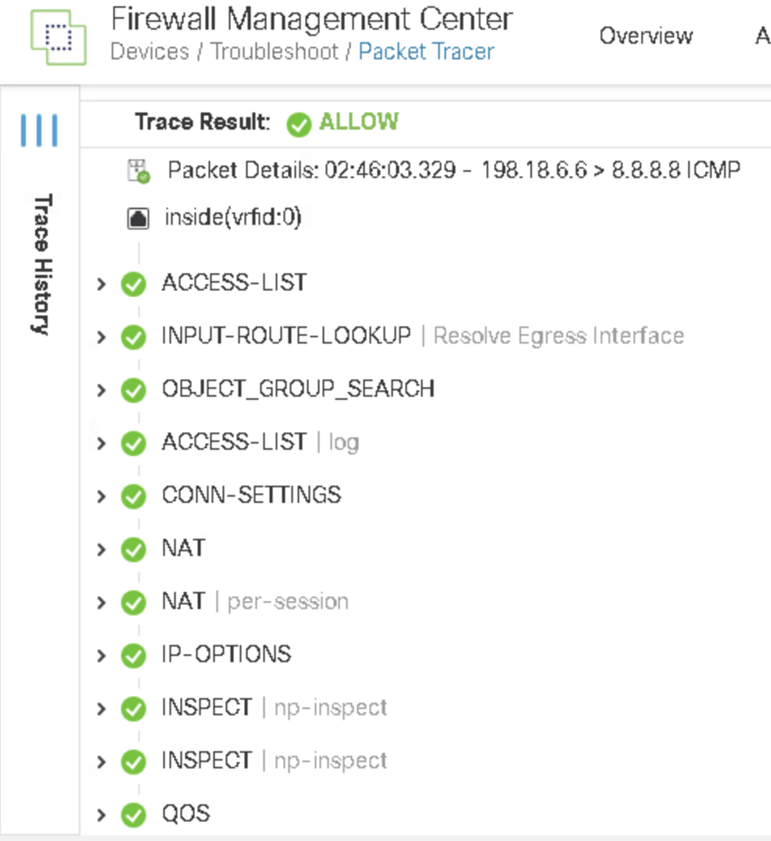

Re-run the test and check the results.

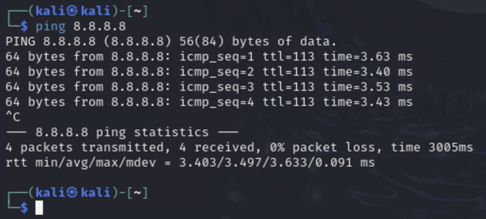

## Task 4

Allow traffic from outside 198.18.2.x to inside 198.18.6.x (by default both PCs
cannot ping/connect to the 198.18.6.x network).

**Check Kali PC IP/Mask/Gateway/routing and ping test**

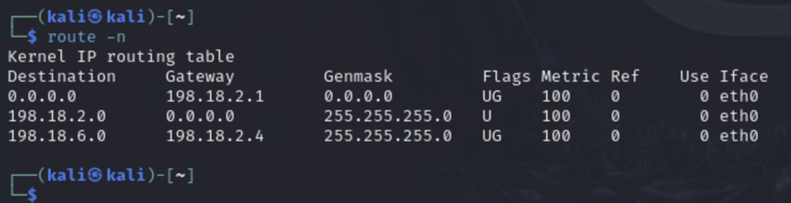

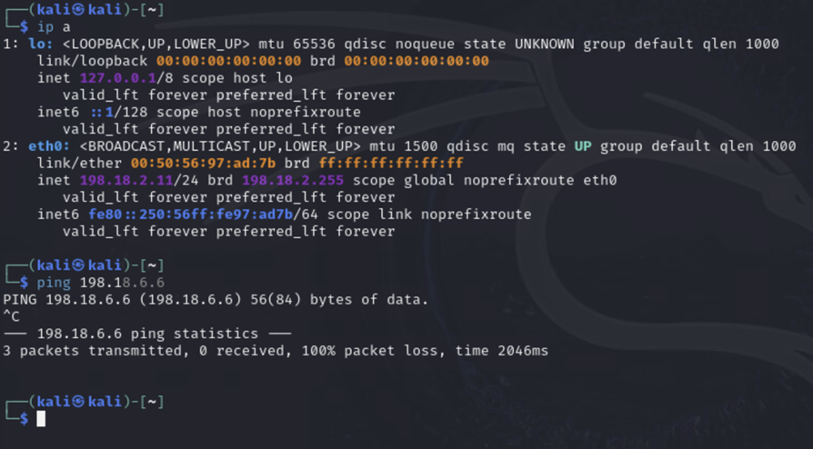

**Check Windows PC IP/Mask/Gateway/routing and ping test**

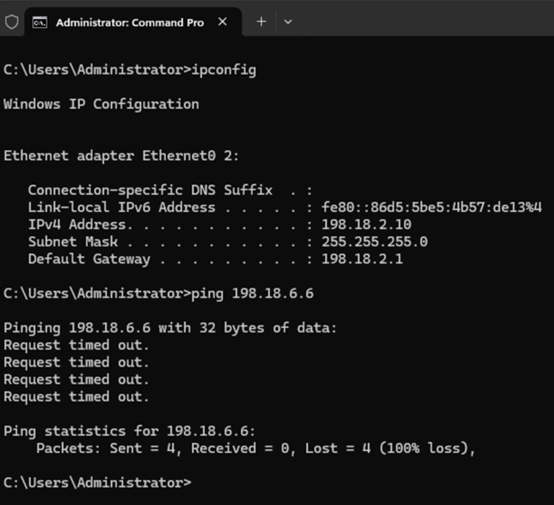

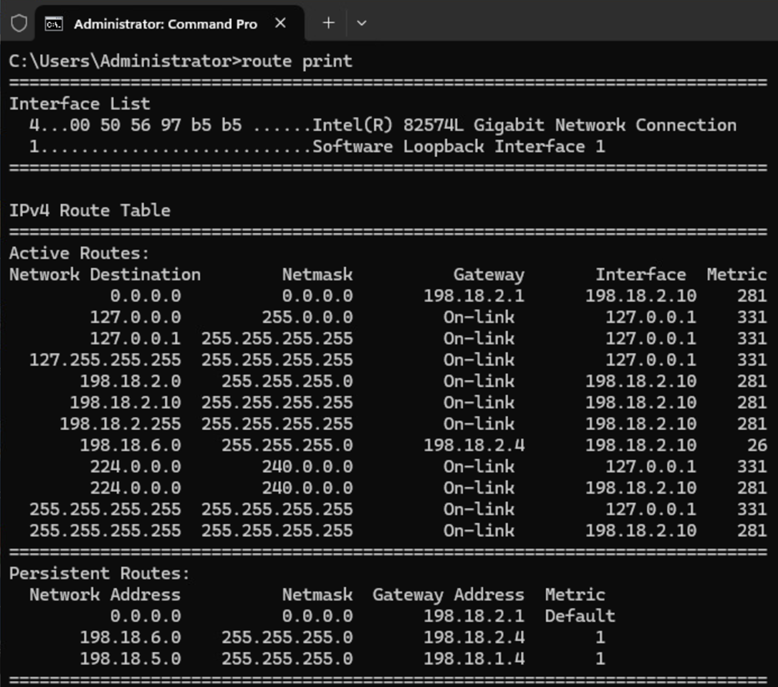

**Configure ACP and NAT rules to allow that traffic**

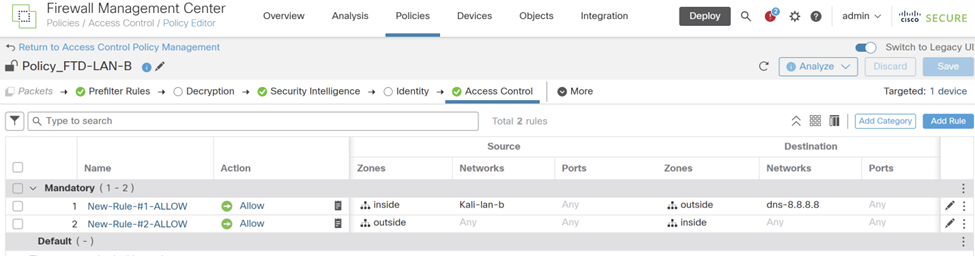

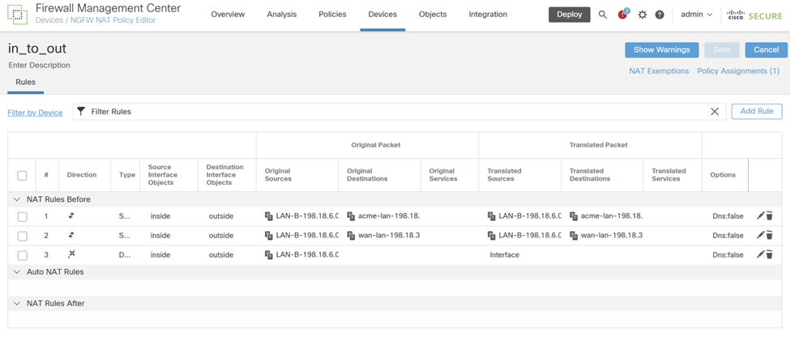

Then re-run tests again.


## Task 5

IPS Policy creating and testing. In this scenario we will create an IPS rule to
block icmp traffic. To test the policy, please generate traffic between the
inside and outside interfaces.


**Apply IPS policy to ACP rule**


Deploy the changes.

**Check the events (under connection events or unified events)**


## Task 6

Your task is to configure a site-to-site VPN between the two sites (details
below). Finally, to verify the success of this task, you should be able to
establish connectivity (ping) between 198.18.5.0/24 and 198.18.6.0/24. If not,
please start troubleshooting.

| Device | URL / Access | Username | Password |
| --- | --- | --- | --- |
| FMC | https://198.18.1.2 | admin | Cisco@123 |
| Windows 11 | console | admin | C1sco12345 |
| Kali Linux | console | kali | C1sco12345 |

**Site to Site VPN Diagram and details**

```text
1. OUTSIDE
   Firepower FTD = 198.18.1.4
   Encrypted traffic = 198.18.5.0/24

2. ACME
   Firepower FTD = 198.18.2.4
   Encrypted traffic = 198.18.6.0/24
```


These are all the test tasks:

```text
1. ping from 198.18.6.6 to 198.18.5.6
2. ping from 198.18.5.6 to 198.18.6.6
```

**Create site to site VPN in FMC 198.18.2.2**


**Site to Site VPN Unknown Status**


**ACP Rule (allow all)**


**NAT Rules**


**Site to Site VPN Active Status** (Please note: VPN shows as active once you
configure the remote site only)


**Testing from Kali PC**


**Check STS VPN status through FTD CLI (198.18.2.3)**


**Check STS VPN status through FMC**


**Create site to site VPN in FMC 198.18.1.2**

Site to Site VPN Unknown Status.


**Testing from Kali PC**


**Check STS VPN status through FTD CLI (198.18.1.3)**


**Event View**


**Check STS VPN status through FMC**


## Task 7

- This task tests the Secure Firewall file policy.
- Kali PC (198.18.6.6) trying to download a blocked file from web server (198.18.2.11).
- (For testing purposes, please host the web server on Kali PC 198.18.2.11 using
  the Python web module shown at the bottom of this page. Also make sure to
  download a test jpg file from Google to the 198.18.2.11 folder.)


**Creating File Policy in Secure Firewall**


**Hosting web server in Kali PC**


**Client trying to download the file**


**Web server logs**


**Secure Firewall logs**


## Kali linux tcpdump

**Specific traffic from / to**


**Any traffic between hosts**


## Host web server in kali linux


