# Theory

## Firepower Threat Defense (FTD) overview

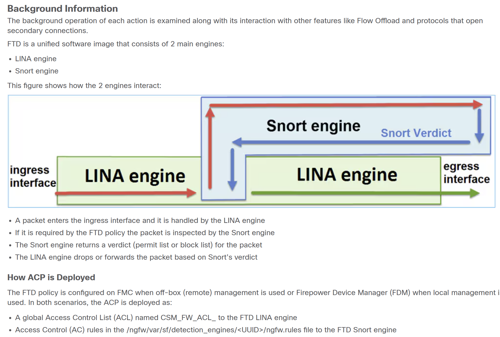

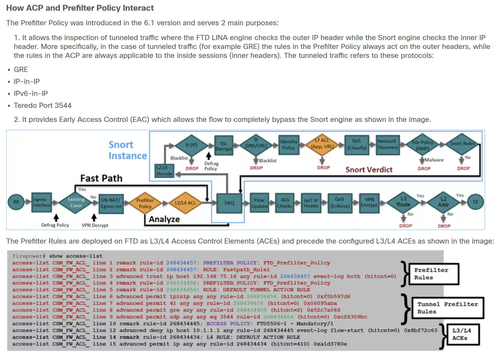

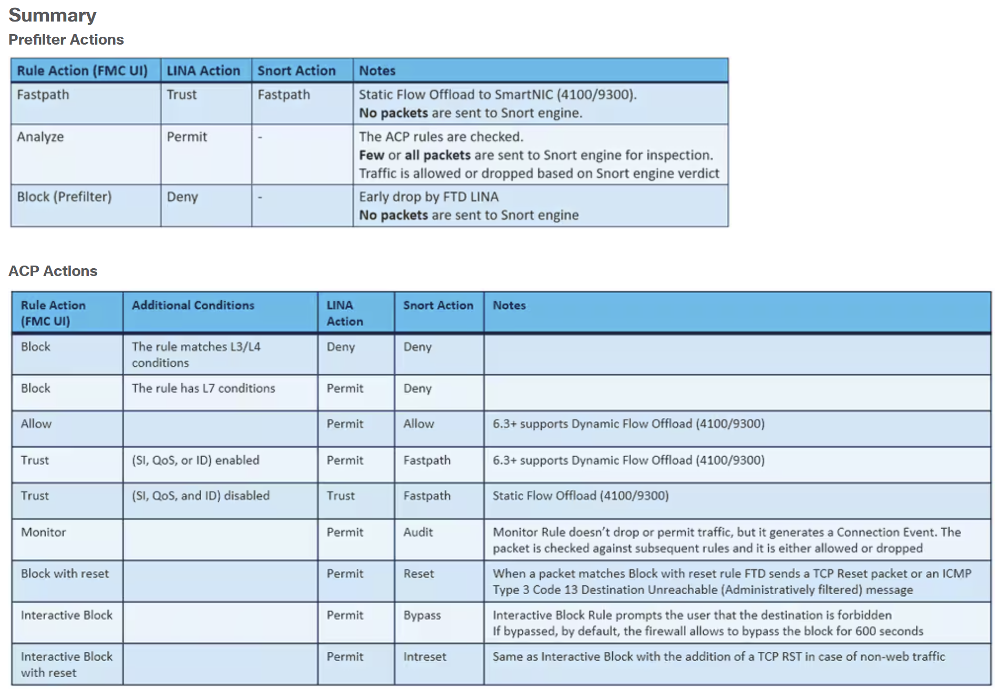

## Part 1: Understanding show asp drop

🧩 **What it is**

`asp` = Accelerated Security Path — the internal data plane of ASA/FTD that
handles packet classification, session creation, NAT, ACL checks, inspections,
etc.

When packets are discarded before establishing a flow, they're counted in ASP
drop counters. These counters tell why a packet didn't make it through the
dataplane.

📘 **Command syntax**

```text
show asp drop
```

Displays categories and counters of packets dropped by the Accelerated Security
Path. You can clear counters with:

```text
clear asp drop
```

then generate traffic again — ideal for labs.

🔍 **Common ASP Drop Reasons &amp; Meanings**

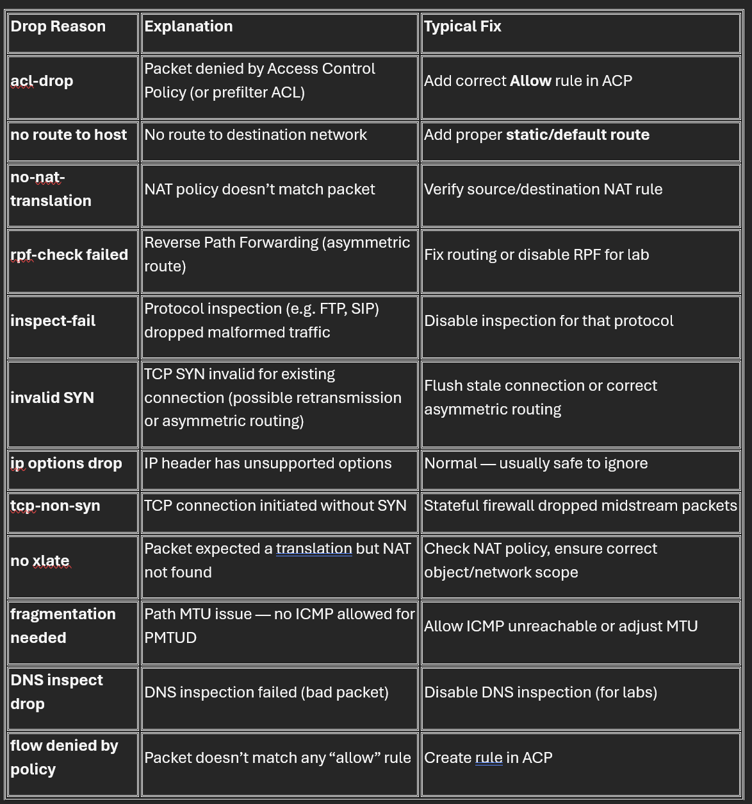

## Part 2: Using packet-tracer (virtual packet simulation)

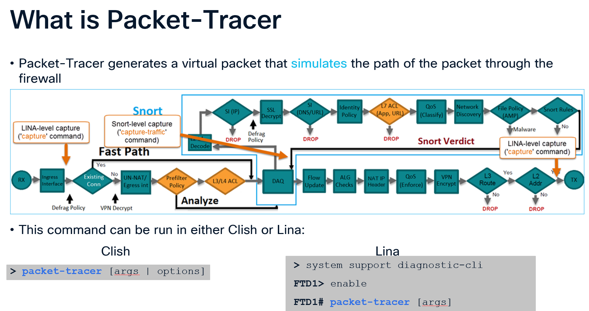

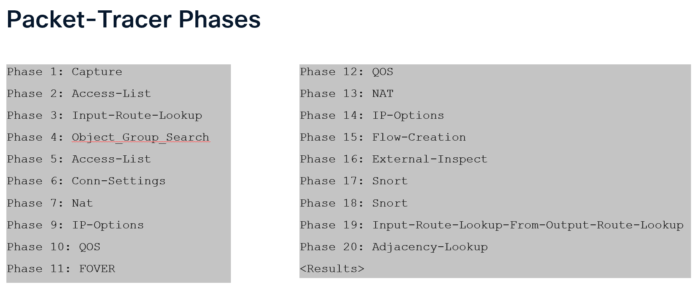

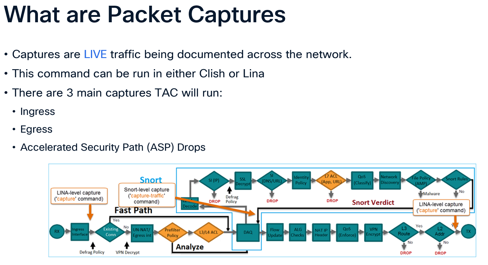

🧩 **Purpose**

`packet-tracer` is a software path simulation — it walks the packet through the
FTD dataplane (NAT, ACL, routing, inspection, etc.) without actually sending it
on the wire. It tells you step-by-step whether the packet is Allowed or Dropped
and why.

🧪 **Basic Syntax**

```text
packet-tracer input <in_interface> <protocol> <src_ip> <src_port> <dst_ip> <dst_port> [options]
```

Example:

```text
packet-tracer input inside icmp 192.168.5.10 8 0 8.8.8.8 detailed
```

Simulates ICMP echo (type 8, code 0) from 192.168.5.10 to 8.8.8.8 entering on
interface "inside".

For TCP:

```text
packet-tracer input inside tcp 192.168.5.10 12345 80 142.250.70.36 detailed
```

Simulates TCP from inside host to web server.

🧠 **How to Read the Output**

Each Phase shows a processing step.

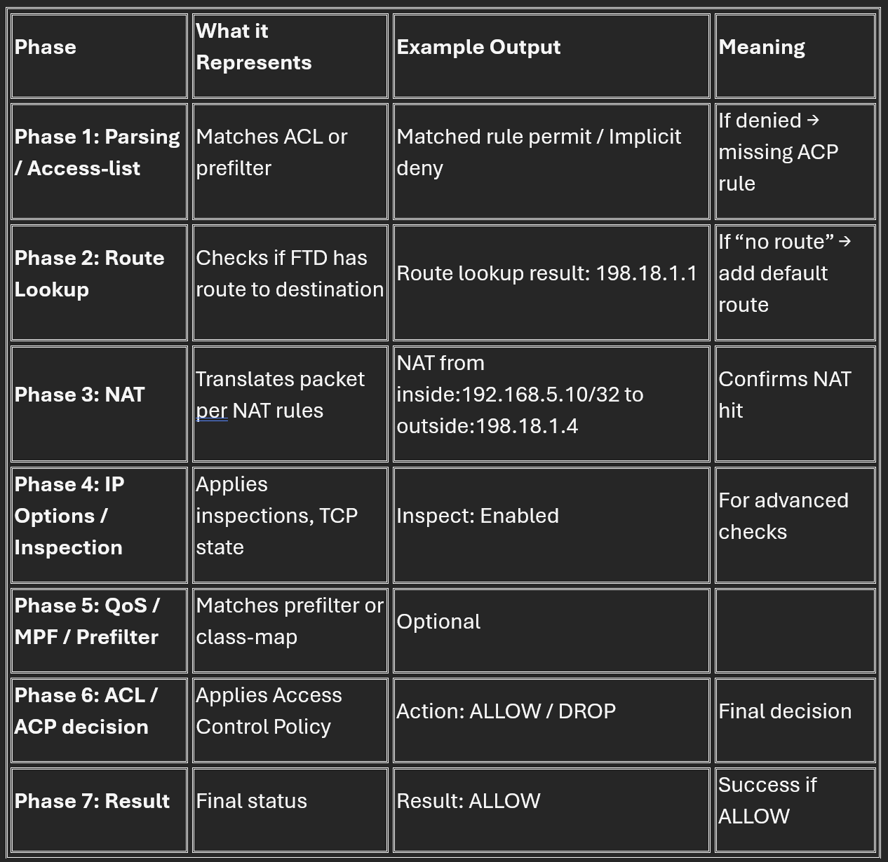

📋 **Common Test Conditions**

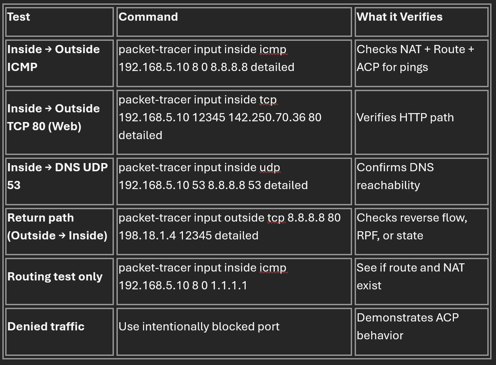

🧩 **Interpreting Key Results**

- ✅ Result: ALLOW → All path stages succeeded.
- ❌ Result: DROP → Last phase shows drop reason, e.g.:
    - Access-list: implicit deny
    - No valid route
    - Flow is denied by policy
    - NAT not found for ...

🧰 **Combined Lab Exercise (ASP + Packet-Tracer)**

1. From PC: try to ping 8.8.8.8 — expect fail (no ACP).
2. On FTD:

    ```text
    clear asp drop
    show asp drop
    ```

    Run:

    ```text
    packet-tracer input inside icmp 192.168.5.10 8 0 8.8.8.8 detailed
    ```

- Note: It will drop at Access Control phase.
- Add an ACP Allow Inside→Outside rule in FMC.
- Deploy → re-run steps.
- Now packet-tracer should end with Result: ALLOW, and show asp drop counters
  remain unchanged.

!!! info "Reference"
    <https://www.cisco.com/c/en/us/support/docs/security/firepower-ngfw/212321-clarify-the-firepower-threat-defense-acc.html>

# 🔹 Overview: What packet-tracer actually does

It virtually injects a packet into the FTD engine, then shows how that packet is
processed by every logic block (phase). Each phase corresponds to an internal
subsystem:

1. Parsing / Pre-Routing
2. Security-Zone Mapping
3. Interface-Based ACL or Prefilter
4. Route Lookup
5. NAT / Xlate Selection
6. VPN / Tunnel Policy Check
7. QoS / Service-Policy Match
8. Application or Protocol Inspection
9. Access-Control Policy Evaluation (Snort)
10. Post-Routing / Egress Decision
11. Result Summary

## 🧩 Phase-by-Phase Breakdown

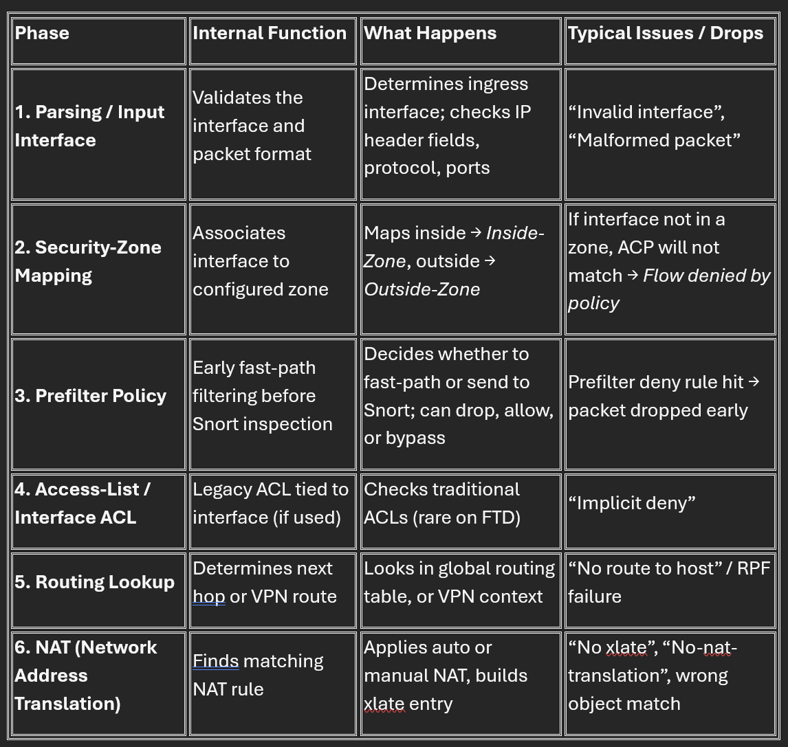

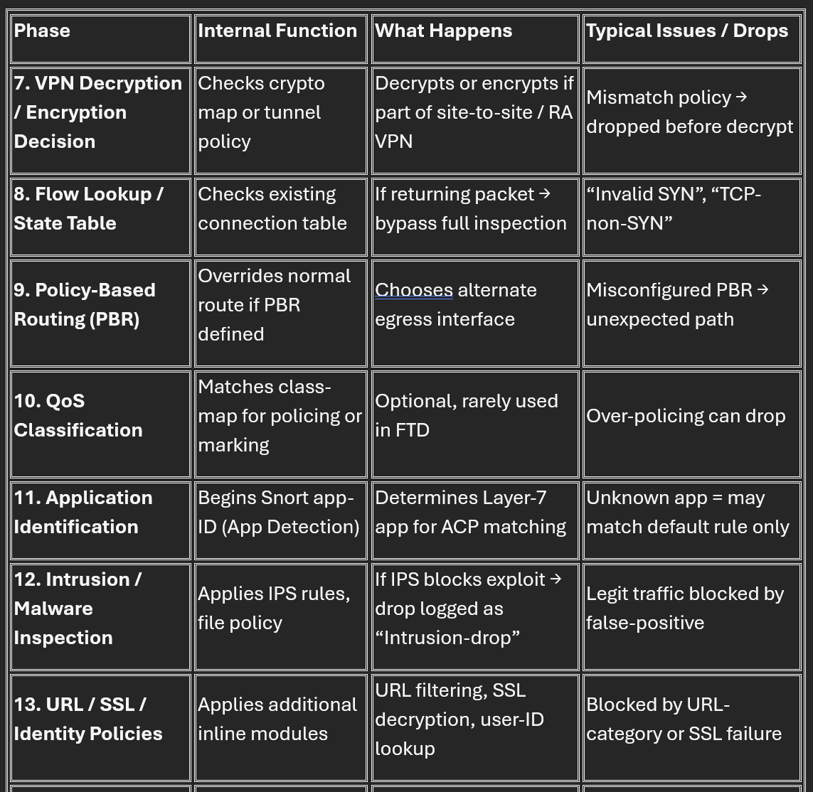

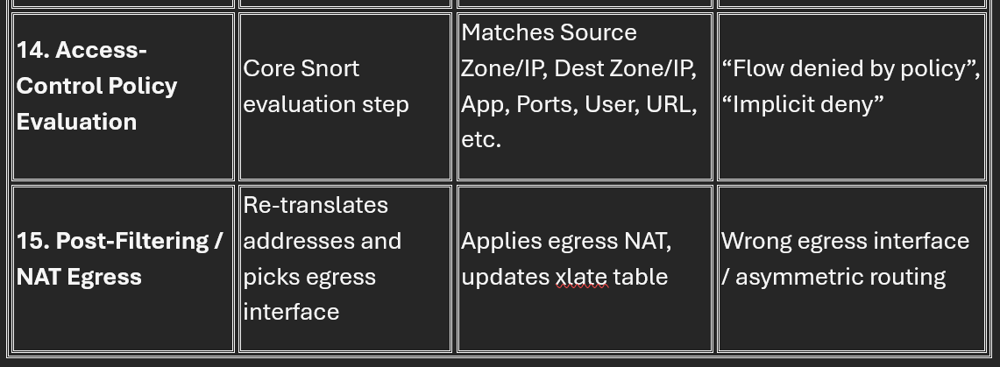

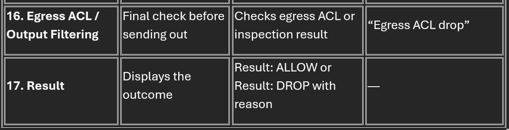

🧠 **Example Output (simplified)**

```text
Phase 1: Parsing
  packet type: IPv4
  protocol: icmp
Phase 2: Security Zone lookup
  inside → INSIDE-ZONE
Phase 3: Prefilter Policy
  No prefilter rule matched
Phase 4: Routing lookup
  Route found: via outside, next-hop 198.18.1.1
Phase 5: NAT
  Dynamic PAT rule matched: 192.168.5.0/24 to outside interface
Phase 6: Access-Control
  Rule: Allow_INSIDE_to_OUTSIDE, Action: Allow, Logging: At End
Phase 7: Result
  Action: ALLOW
```

If something fails:

```text
Phase 6: Access-Control
  Rule: Implicit Deny
Phase 7: Result
  Action: DROP (Flow denied by policy)
```

🔍 **Additional Hidden / Conditional Phases**

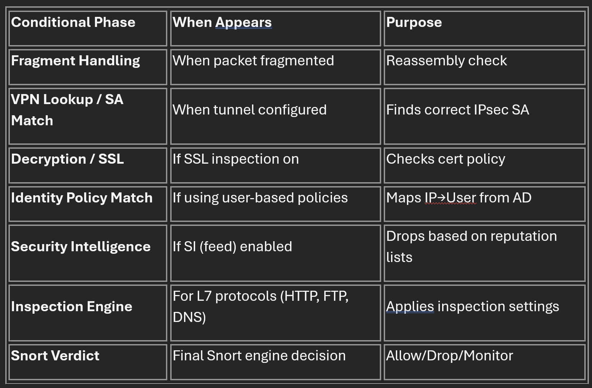

📊 **Relationship Between Packet-Tracer and ASP-Drops**

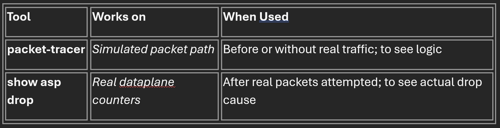

You can correlate them:

- If packet-tracer ends in Flow denied by policy → real traffic likely increases
  acl-drop or policy-drop counter in show asp drop.
- If packet-tracer says No route to host → show asp drop shows no route to host.

# Access Control Policy (ACP)

## 🔹 1. What is an Access Control Policy (ACP)?

An Access Control Policy in FTD defines what traffic is allowed, inspected, or
blocked, and what inspection or threat-prevention actions apply. Think of it as a
next-generation firewall rule base that merges:

- Traditional firewall (Layer 3/4 ACLs)
- Application control (Layer 7)
- User and URL filtering (Identity &amp; Web categories)
- Intrusion Prevention (IPS)
- Malware inspection (File Policy)
- Logging and eventing

## 🔹 2. ACP Structure in Cisco FMC

In FMC (Firepower Management Center), the ACP contains:

| Section | Description |
| --- | --- |
| Prefilter Policy (optional) | Very early fast-path filter before Snort inspection (used for VPNs or trusted traffic). |
| Access Control Rules | The ordered rule list that evaluates traffic (top → bottom). |
| Default Action | The fallback action for any packet that doesn't match a rule. |
| Policy Assignments | You can assign one ACP to multiple devices or device groups. |

## 🔹 3. ACP Evaluation Flow

Traffic flow inside FTD once a connection begins:

1. Packet enters an interface → mapped to Security Zone
2. Prefilter Policy (if configured) → Allow, Block, or Fastpath
3. NAT applied
4. Access Control Policy rules are evaluated (top-down)
5. First match determines:
    - Action (Allow, Block, Trust, etc.)
    - Optional inspection (IPS, File, URL)
6. Default Action applies if no rule matches
7. Packet either passes, drops, or bypasses inspection

## 🔹 4. Types of ACP Rules (By Action)

Each rule type determines how the traffic is handled. Below are all available
Actions you can configure in FMC.

## 🧭 Summary Table

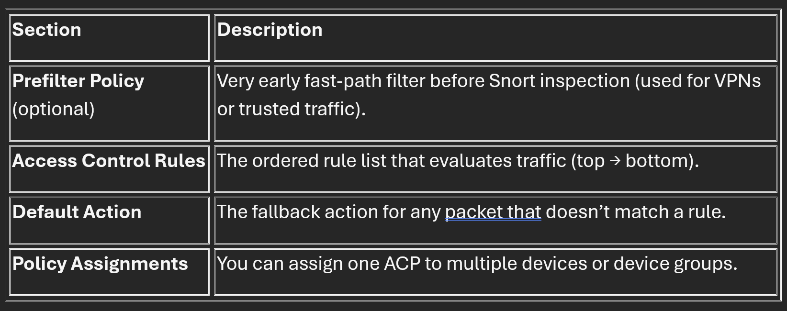

# NAT

## 🔹 1. NAT Overview in Cisco FTD

Cisco FTD (like ASA) uses the unified NAT engine, supporting both:

- Manual NAT (Twice NAT)
- Auto NAT (Object NAT)
- Identity NAT
- Dynamic and Static translations
- Policy-based NAT
- NAT exemption (no-NAT)

FTD NAT occurs before the Access Control Policy (ACP), meaning: The ACP sees the
translated IPs, not the originals.

## 🔹 2. NAT Processing Order in FTD

When a packet arrives, FTD checks NAT rules in this sequence:

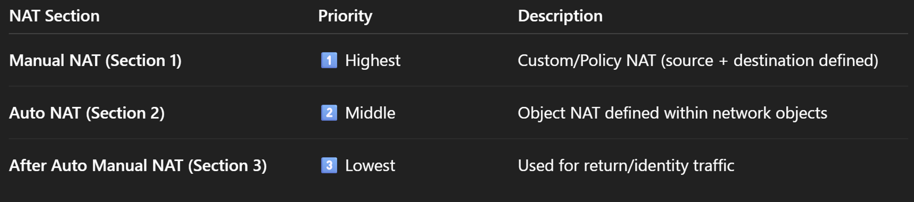

## 🔹 3. NAT Classification by Function

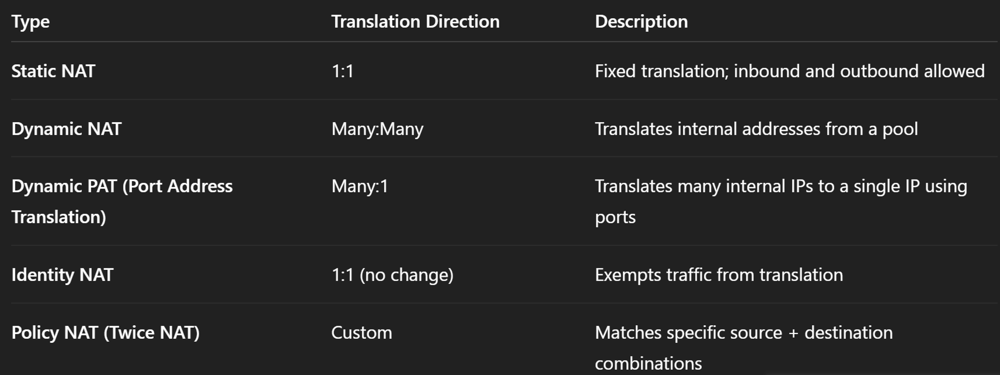

## 12. NAT Rule Examples (Summary)

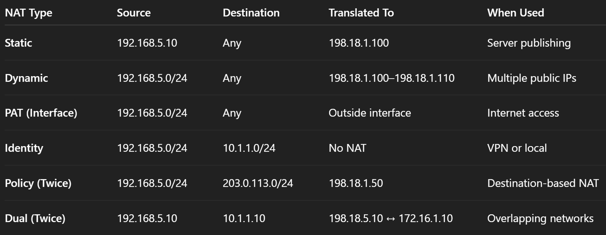

## 14. NAT Troubleshooting Commands

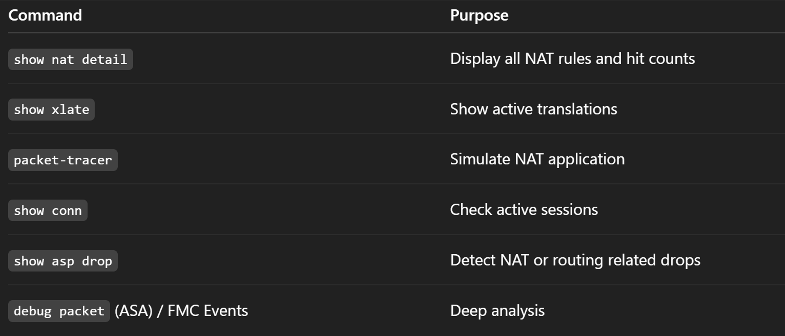

# VPN

## FTD VPN Types at a Glance

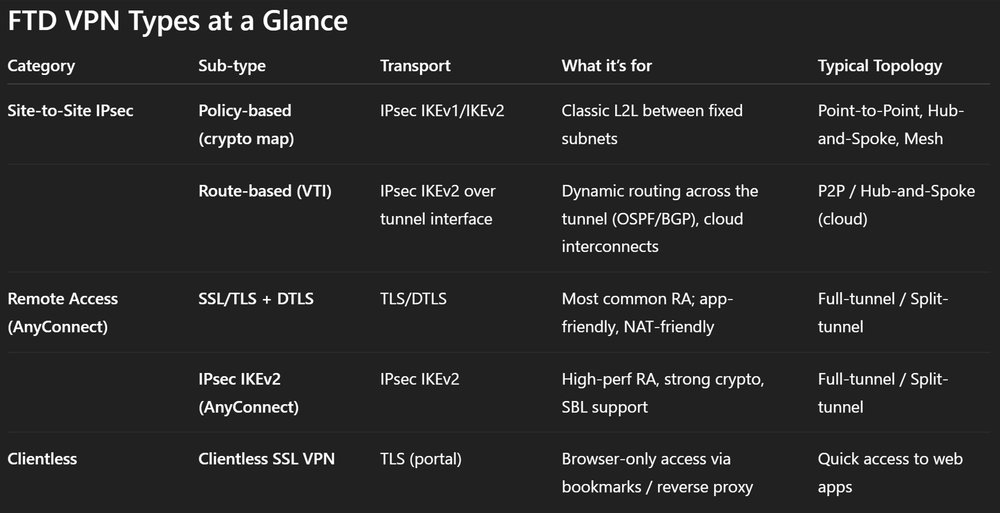

**Troubleshooting Playbooks**

*Site-to-Site (both types)*

```text
1.  Phase-1/IKE check
  o show crypto ikev2 sa (or ikev1 if used)
  o Look for READY/ESTABLISHED; if not:
   PSK/cert mismatch, proposal mismatch, peer ID mismatch (FQDN/IP), clock skew.
2.  Phase-2/IPsec check
  o show crypto ipsec sa → packet counters encap/decap increasing?
  o If encap only: return path/ACL/route on peer, or NAT problem.
3.  Routing
  o Policy-based: correct Identity NAT + static routes.
  o Route-based: route or BGP/OSPF adjacencies up?
4.  Firewall policy
  o ACP allows tunnel zone → Inside (and reverse if needed).
5.  Captures (outside)
  o capture isakmp interface outside match udp any any eq 500
  o capture natt interface outside match udp any any eq 4500
  o capture esp interface outside match ip proto 50 any any
6.  Common ASP drops
  o show asp drop → acl-drop / no-route / rpf-check-failed
```

If CLI is restricted, use `system support diagnostic-cli` on FTD to run ASA-style
commands above.

*Remote Access (AnyConnect)*

```text
1.  Session status
  o show vpn-sessiondb anyconnect
  o Connected? Username, IP, group-policy?
2.  Handshake path
  o SSL: check portal cert/CAs; intermediate CA chain complete.
  o IKEv2: show crypto ikev2 sa and show crypto ipsec sa.
3.  Address pool & routing
  o Pool assigned? Conflicts?
  o Split-tunnel list correct? DNS pushed?
4.  Full-tunnel Internet
  o U-turn NAT present? ACP allows RA → OUTSIDE?
5.  MFA/Identity
  o RADIUS/SAML logs; FMC Analysis → VPN events.
6.  Packet traces
  o packet-tracer input outside udp <client_public> 500 <ftd_outside> 500 detailed (IKE)
  o For data flow: packet-tracer from RA client IP to inside server to verify ACP/NAT path.
```

**Quick Reference (cheat-sheet)**

```text
# IKE/IPsec state
show crypto ikev2 sa
show crypto ikev1 sa
show crypto ipsec sa

# RA sessions
show vpn-sessiondb anyconnect
show webvpn anyconnect               (if available)

# Routing/NAT/Policy
show route
show nat detail
show asp drop

# Captures (outside)
capture isakmp interface outside match udp any any eq 500
capture natt   interface outside match udp any any eq 4500
capture esp    interface outside match ip proto 50 any any
show capture isakmp | count
show capture natt   | count
show capture esp    | count
no capture isakmp
no capture natt
no capture esp
```
